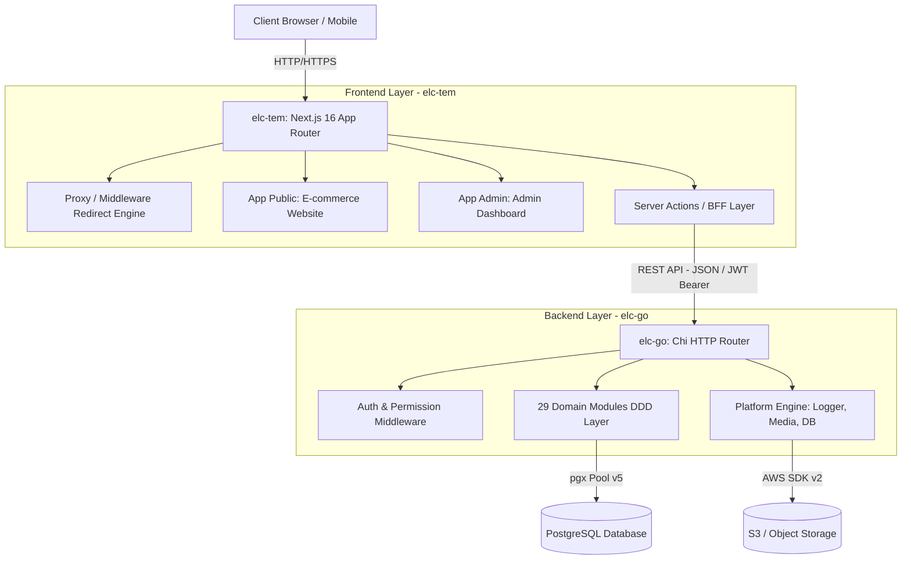
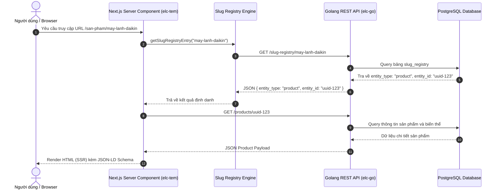
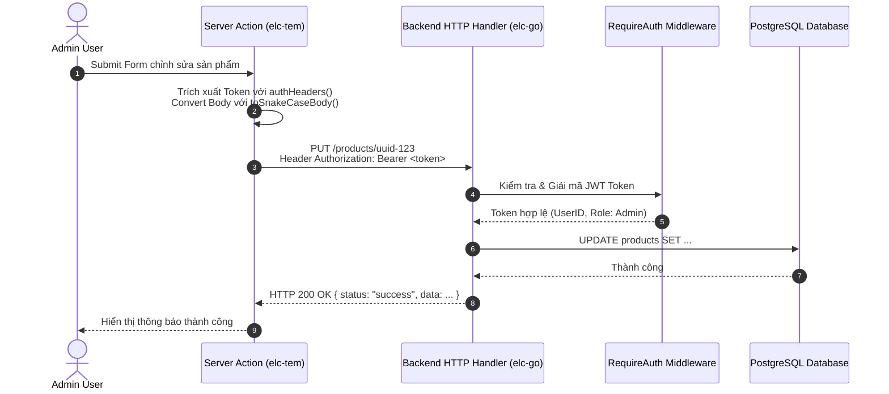

# Tài liệu Kiến trúc Hệ thống ELC (elc-go & elc-tem)

Tài liệu này mô tả chi tiết kiến trúc tổng thể, sơ đồ thiết kế, tổ chức thư mục, luồng dữ liệu và cơ chế giao tiếp giữa hai repository chính trong hệ thống: backend Golang (`elc-go`) và frontend Next.js (`elc-tem`).

---

## 1. Tổng quan Kiến trúc Hệ thống (High-Level Architecture)

Hệ thống được thiết kế theo mô hình Decoupled Architecture (Tách biệt Frontend và Backend):

- **Frontend & BFF (Backend-For-Frontend)**: `elc-tem` xây dựng trên Next.js 16 (App Router), React 19, TypeScript và Tailwind CSS v4. Đảm nhận nhiệm vụ Server-Side Rendering (SSR), Static Site Generation (SSG), giao diện E-commerce công khai cho người dùng và giao diện Admin Dashboard quản trị nội dung.
- **Backend API Core**: `elc-go` xây dựng trên Golang 1.26 và Chi HTTP Router. Đảm nhận nhiệm vụ xử lý toàn bộ logic nghiệp vụ (Business Logic), quản lý cơ sở dữ liệu PostgreSQL, xác thực JWT, xử lý truyền thông S3 (AWS SDK v2), xử lý ảnh và cung cấp các RESTful APIs chuẩn hóa.
- **Database Layer**: PostgreSQL 16+ đóng vai trò làm nguồn dữ liệu tập trung (Single Source of Truth), quản lý toàn bộ dữ liệu danh mục, sản phẩm, bài viết, dự án, tài khoản và hệ thống định danh URL chung (`slug_registry`).



---

## 2. Kiến trúc Backend (`elc-go`)

Backend `elc-go` tuân theo kiến trúc Clean Architecture / Domain-Driven Design (DDD) kết hợp Hexagonal Architecture (Ports and Adapters). Hệ thống được chia làm 29 domain modules riêng biệt trong thư mục `internal/`.

### 2.1. Cấu trúc Module Chuẩn trong `internal/<module_name>`

Mỗi domain module (ví dụ: `internal/product`, `internal/category`, `internal/auth`) đều được đóng gói độc lập theo 4 tầng kiến trúc:

- **`domain`**: Chứa các Entity models, Value Objects, Domain Errors và định nghĩa Interface cho Repository / Services. Tầng này độc lập hoàn toàn với framework và thư viện ngoài.
- **`application`**: Chứa Use Cases, Application Services và DTOs quy định luồng xử lý nghiệp vụ.
- **`infrastructure`**: Triển khai các Interface của domain. Truy xuất cơ sở dữ liệu qua `jackc/pgx/v5`, tương tác với S3 storage hoặc các dịch vụ bên ngoài.
- **`presentation`**: Chứa HTTP Handlers (Chi Router), Request/Response DTOs, Validation logic và đăng ký route vào HTTP server.
- **`migrations`**: File SQL migration độc lập dành riêng cho module đó.

```
internal/product/
├── application/       # Use cases & DTOs
├── domain/            # Entities & Repository Interfaces
├── infrastructure/    # PostgreSQL Repositories & S3 Storage
├── migrations/        # Domain SQL Migrations
└── presentation/      # HTTP Handlers & Route Registration
```

### 2.2. Tầng Nền tảng (`internal/platform`)

Tầng `platform` cung cấp các dịch vụ dùng chung cho toàn bộ hệ thống backend:

- **`platform/db`**: Khởi tạo và quản lý Connection Pool tới PostgreSQL bằng `jackc/pgx/v5/pgxpool`.
- **`platform/httpserver`**:
  - Cấu hình Chi v5 Router, CORS policy, Timeout.
  - Chuẩn hóa format phản hồi HTTP JSON với các hàm trợ giúp như `JSON()`, `Created()`, `NoContent()`, `Error()`.
  - Middlewares: `RequireAuth()`, `RequirePermission()`, `RateLimiter()`.
- **`platform/logger`**: Logger cấu trúc sử dụng `go.uber.org/zap`.
- **`platform/media`**: Tương tác với S3 bucket qua AWS SDK v2, tích hợp thư viện `imaging` để crop và nén ảnh.
- **`platform/apperr`**: Mapper chuyển đổi Domain Errors thành mã lỗi HTTP (400, 401, 403, 404, 500) thống nhất.
- **`platform/seo`**: Công cụ tạo và quản lý sitemap, metadata tự động.

### 2.3. Danh sách 29 Domain Modules trong `elc-go`

1. **Product V2 & Catalog**: `product`, `category`, `brand`, `attribute`, `group`, `slug-registry`, `tag`.
2. **CMS & Nội dung**: `news`, `author`, `page`, `hp-page`, `system-page`, `event`.
3. **Dịch vụ & Dự án Thương mại**: `service`, `service-group`, `project`, `project-type`, `branch`, `shippingzone`, `inquiry`, `contact`.
4. **Người dùng & Tương tác**: `auth`, `review`, `wishlist`, `recently-viewed`, `chat-log`, `settings`, `upload`.

### 2.4. Công cụ Command Line (`cmd/`)

- `cmd/server/main.go`: Entry point khởi chạy HTTP Server trên cổng 8090, khởi tạo connection pool và wire tất cả 29 domain modules.
- `cmd/seed-admin`: Script khởi tạo tài khoản Admin tối cao ban đầu.
- `cmd/generate-image-crops`: Script tự động tạo các bản crop ảnh theo chuẩn giao diện.
- `cmd/migrate-images`: Script chuyển đổi và lưu trữ tài nguyên hình ảnh lên S3.
- `cmd/migrate-specs-to-attributes`: Script chuyển đổi dữ liệu thông số kỹ thuật cũ sang hệ thống thuộc tính linh hoạt (Attribute Definitions).
- `cmd/train-chat-classifier`: Script huấn luyện bộ phân loại ý định tìm kiếm bài viết / sản phẩm cho trợ lý AI chat.

---

## 3. Kiến trúc Frontend & BFF (`elc-tem`)

Frontend `elc-tem` được thiết kế theo mô hình Modular Monolith kết hợp kiến trúc Next.js App Router.

### 3.1. Cấu trúc Thư mục Tổng thể

- **`app/`**: Định nghĩa Route Handlers và Layouts theo chuẩn Next.js 16 App Router.
  - `app/(public)`: Các trang giao diện bán hàng công khai (Trang chủ, Danh mục sản phẩm, Chi tiết sản phẩm, Tin tức, Dự án, Liên hệ).
  - `app/(admin)`: Các trang giao diện Quản trị viên (Dashboard, Quản lý sản phẩm, Quản lý thuộc tính, Bài viết, Cấu hình).
  - `app/api`: API routes xử lý Webhooks, Google Indexing API, Product Feeds.
- **`modules/`**: Các module giao diện và logic riêng biệt cho từng domain (ví dụ: `modules/catalog`, `modules/product-line`, `modules/attribute-definition`, `modules/auth`, `modules/dashboard`). Mỗi module bao gồm:
  - Components: React components chuyên biệt cho module.
  - Actions: Server Actions tương tác trực tiếp với `elc-go`.
  - Hooks: Custom React hooks quản lý state client.
  - Schemas: Zod schemas validation dữ liệu form.
- **`shared/`**: Tài nguyên dùng chung cho toàn bộ dự án:
  - `shared/components`: Hệ thống UI Components dựa trên Radix UI, Base UI, Tailwind CSS v4 và shadcn.
  - `shared/lib/go-api.ts`: Utilities hỗ trợ Server Actions gọi Backend Golang (`authHeaders`, `toSnakeCaseBody`, `getSlugRegistryEntry`).
  - `shared/proxy.ts`: Middleware xử lý SEO redirects và session cookie.
  - `shared/lib/auth`: Quản lý cookie xác thực (`ACCESS_TOKEN_COOKIE`, `REFRESH_TOKEN_COOKIE`).
  - `shared/lib/seo-schema.ts`: Tự động sinh JSON-LD Structured Data chuẩn Google SEO.

### 3.2. Hệ thống SEO Redirect Engine (`shared/proxy.ts`)

Hệ thống tích hợp bộ xử lý chuyển hướng URL tốc độ cao để đảm bảo SEO không bị đứt gãy khi di cư từ hệ thống WordPress cũ sang Next.js:

1. **Static Map Lookup O(1)**: Đọc từ `redirects-map.json` chứa hơn 10.000 URL tĩnh cũ và redirect ngay lập tức với mã HTTP 308 Permanent Redirect.
2. **Regex Prefix Fallback**: Xử lý các đường dẫn dạng `/category/`, `/product/`, `/danh-muc/`, `/dien-may/`, `/he-thong-cap-khi-tuoi/` và chuyển về cấu trúc chuẩn `/san-pham/{slug}` hoặc `/tin-tuc/{slug}`.
3. **Session Keeper**: Tiếp tục chuyển tiếp tới `updateSession()` để duy trì trạng thái đăng nhập người dùng.

---

## 4. Cơ chế Giao tiếp và Luồng Dữ liệu (Data Flow & Communication)

### 4.1. Luồng Truy vấn và Hiển thị Dữ liệu (Read Flow - SSR/SSG)



### 4.2. Luồng Ghi Dữ liệu và Xác thực (Write Flow & Auth)

1. **Đăng nhập**: User gửi thông tin đăng nhập từ giao diện Admin/Public. Frontend gọi `POST /auth/login` trên `elc-go`. `elc-go` xác thực password đã hash bằng Argon2id và cấp cặp JWT Token (Access Token và Refresh Token).
2. **Lưu Token**: Frontend lưu Access Token vào HTTP-Only Cookie (`ACCESS_TOKEN_COOKIE`).
3. **Thực thi Server Action**: Khi Admin thực hiện thao tác Thêm/Sửa/Xóa dữ liệu:
   - Server Action trong `elc-tem` gọi hàm `authHeaders()` để trích xuất Access Token từ Cookie.
   - Sử dụng `toSnakeCaseBody()` để tự động chuyển đổi định dạng field từ camelCase (TypeScript) sang snake_case (Golang JSON tag).
   - Gửi HTTP Request (POST/PUT/DELETE) kèm Header `Authorization: Bearer <token>` tới `elc-go`.
   - Middleware `RequireAuth()` trên `elc-go` giải mã JWT Token, kiểm tra quyền hạn (Role/Permission) và thực thi nghiệp vụ xuống Database.



---

## 5. Bảng Tóm tắt Công nghệ (Technology Stack Summary)

| Hạng mục | Frontend (`elc-tem`) | Backend (`elc-go`) |
| :--- | :--- | :--- |
| **Ngôn ngữ** | TypeScript / JavaScript | Go (Golang 1.26) |
| **Framework / Core** | Next.js 16 (App Router), React 19 | Chi Router v5 |
| **Styling / UI** | Tailwind CSS v4, Radix UI, Base UI, TipTap Editor | N/A |
| **Database Driver** | N/A (Gọi qua Go REST API) | `jackc/pgx/v5` (PostgreSQL Connection Pool) |
| **Logging** | Console / Edge Logging | `go.uber.org/zap` |
| **Storage / Media** | Client-side File Upload Handler | AWS SDK Go v2 (S3), `kovidgoyal/imaging` |
| **Authentication** | Cookie-based Token Forwarding | JWT (`golang-jwt/jwt/v5`), Argon2id Hashing |
| **SEO & Routing** | Custom Middleware Proxy 308 Redirects | Slug Registry Universal Lookup Service |
