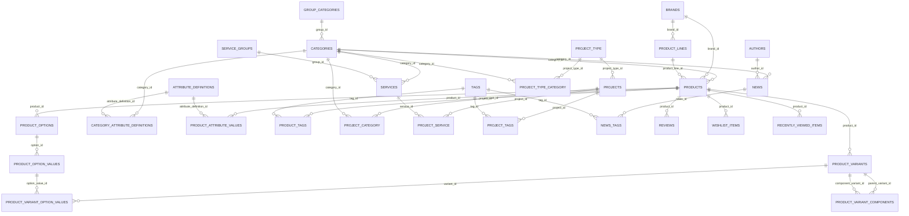

# Sơ đồ ERD và Quan hệ Database trong backend Golang (elc-go)

Tài liệu thiết kế sơ đồ quan hệ thực thể (ERD) và danh sách khóa ngoại của toàn bộ 29 module đang hoạt động trong backend Golang (`elc-go`).

## 1. Sơ đồ ERD (Entity Relationship Diagram - Golang Core)

## 2. Chi tiết kiến trúc các Module trong Golang (`elc-go/internal`)

### Module Product V2 & Catalog (`internal/product`, `internal/category`, `internal/brand`)
1. **`group_categories` -> `categories` (1 - N)**
   - Nhóm danh mục gốc quản lý các danh mục con.
2. **`brands` -> `product_lines` (1 - N)**
   - Quản lý dòng sản phẩm theo từng thương hiệu (ví dụ: dòng máy lạnh FTKB, FTKF của Daikin).
3. **`categories`, `brands`, `product_lines` -> `products` (1 - N)**
   - Mỗi sản phẩm thuộc 1 danh mục, 1 thương hiệu và có thể liên kết 1 dòng sản phẩm.
4. **`products` -> `product_variants` (1 - N)**
   - Đơn vị bán lẻ thực tế (Purchasable Unit) chứa mã MPN, SKU, GTIN, giá vốn, giá niêm yết, giá khuyến mãi, phần trăm giảm giá và trạng thái tồn kho.
5. **`products` -> `product_options` -> `product_option_values` (1 - N - N)**
   - Quản lý tùy chọn thuộc tính biến thể (Màu sắc, Dung tích, Công suất) và giá trị tương ứng.
6. **`product_variant_option_values` (N - N Join Table)**
   - Khóa ghép `(variant_id, option_value_id)` xác định cấu hình cho từng biến thể.
7. **`product_variant_components` (Self-referencing N - N)**
   - Quản lý các bộ sản phẩm combo / split-system (Dàn nóng + Dàn lạnh ghép thành 1 bộ bán lẻ).

### Module Thuộc tính động (`internal/attribute`)
1. **`attribute_definitions` -> `category_attribute_definitions` <- `categories` (N - N)**
   - Chuẩn hóa các trường thông số kỹ thuật (Spec metadata). Gán thuộc tính dùng chung vào các danh mục tương ứng.
2. **`products` -> `product_attribute_values` <- `attribute_definitions` (N - N)**
   - Lưu giá trị thuộc tính cho từng sản phẩm theo các kiểu dữ liệu (`value_text`, `value_number`, `value_boolean`).

### Module Dịch vụ & Dự án (`internal/service`, `internal/project`, `internal/project-type`)
1. **`service_groups` -> `services` (1 - N)**
   - Phân nhóm dịch vụ lắp đặt, bảo trì, sửa chữa.
2. **`project_type` -> `projects` (1 - N)**
   - Phân loại công trình / dự án thi công.
3. **`project_category`, `project_service`, `project_tags` (N - N Join Tables)**
   - Liên kết dự án với danh mục sản phẩm liên quan, các dịch vụ đã triển khai và thẻ tag dự án.

### Module Tin tức & Tác giả (`internal/news`, `internal/author`)
1. **`authors` -> `news` (1 - N)**
   - Thông tin tác giả bài viết (Avatar, Bio, Meta SEO).
2. **`categories` -> `news` (1 - N)**
   - Danh mục phân loại bài viết.
3. **`news_tags` (N - N Join Table)**
   - Gán thẻ tag cho các bài viết.

### Module Tương tác & Khách hàng (`internal/review`, `internal/wishlist`, `internal/recently-viewed`, `internal/inquiry`)
1. **`products` -> `reviews` (1 - N)**
   - Lưu trữ đánh giá, số sao rating và nhận xét sản phẩm.
2. **`products` -> `wishlist_items` / `recently_viewed_items` (1 - N)**
   - Quản lý danh sách sản phẩm yêu thích và lịch sử xem sản phẩm của người dùng.
3. **`inquiries`**
   - Quản lý yêu cầu tư vấn, báo giá, liên hệ từ khách hàng.

### Module Hệ thống & SEO (`internal/slug-registry`, `internal/branch`, `internal/contact`, `internal/shippingzone`)
1. **`slug_registry`**
   - Đảm bảo tính duy nhất của tất cả đường dẫn URL Slug (`entity_id`, `entity_type`, `slug`) trên toàn bộ hệ thống.
2. **`branches` & `contacts`**
   - Danh sách chi nhánh, cửa hàng, bản đồ Google Maps và các kênh liên hệ.
3. **`shipping_zones`, `districts`, `wards`**
   - Cơ sở dữ liệu hành chính và cấu hình phí vận chuyển theo khu vực.

---

## 3. Bảng tổng hợp quan hệ khóa ngoại (Foreign Keys Table)

| Bảng nguồn | Khóa ngoại | Bảng đích | Hành vi xóa | Mô tả quan hệ |
| :--- | :--- | :--- | :--- | :--- |
| categories | group_id | group_categories(id) | SET NULL | Danh mục thuộc Nhóm danh mục |
| product_lines | brand_id | brands(id) | CASCADE | Dòng sản phẩm thuộc Thương hiệu |
| product_lines | category_id | categories(id) | SET NULL | Dòng sản phẩm giới hạn theo Danh mục |
| products | category_id | categories(id) | RESTRICT | Sản phẩm thuộc Danh mục |
| products | brand_id | brands(id) | RESTRICT | Sản phẩm thuộc Thương hiệu |
| products | product_line_id | product_lines(id) | SET NULL | Sản phẩm thuộc Dòng sản phẩm |
| products | default_variant_id | product_variants(id) | SET NULL | Biến thể mặc định của sản phẩm |
| product_variants | product_id | products(id) | CASCADE | Biến thể thuộc Sản phẩm |
| product_options | product_id | products(id) | CASCADE | Tùy chọn thuộc Sản phẩm |
| product_option_values | option_id | product_options(id) | CASCADE | Giá trị thuộc Tùy chọn |
| product_variant_option_values | variant_id | product_variants(id) | CASCADE | Bảng nối Biến thể - Giá trị tùy chọn |
| product_variant_option_values | option_value_id | product_option_values(id) | CASCADE | Bảng nối Biến thể - Giá trị tùy chọn |
| product_variant_components | parent_variant_id | product_variants(id) | CASCADE | Bộ sản phẩm - Biến thể cha |
| product_variant_components | component_variant_id | product_variants(id) | CASCADE | Bộ sản phẩm - Biến thể thành phần |
| category_attribute_definitions | category_id | categories(id) | CASCADE | Bảng nối Danh mục - Thuộc tính |
| category_attribute_definitions | attribute_definition_id | attribute_definitions(id) | CASCADE | Bảng nối Danh mục - Thuộc tính |
| product_attribute_values | product_id | products(id) | CASCADE | Giá trị thuộc tính của Sản phẩm |
| product_attribute_values | attribute_definition_id | attribute_definitions(id) | CASCADE | Định nghĩa thuộc tính áp dụng |
| services | category_id | categories(id) | SET NULL | Dịch vụ thuộc Danh mục |
| services | group_id | service_groups(id) | SET NULL | Dịch vụ thuộc Nhóm dịch vụ |
| projects | project_type_id | project_type(id) | SET NULL | Dự án thuộc Loại dự án |
| news | category_id | categories(id) | SET NULL | Tin tức thuộc Danh mục |
| news | author_id | authors(id) | SET NULL | Tin tức thuộc Tác giả |
