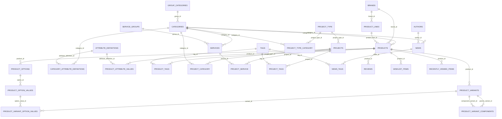

# Sơ đồ ERD và Quan hệ Database

Tài liệu tổng hợp về sơ đồ quan hệ thực thể (ERD) và chi tiết quan hệ giữa các bảng trong cơ sở dữ liệu dự án.

## 1. Sơ đồ ERD (Entity Relationship Diagram)

## 2. Chi tiết các nhóm quan hệ trong Database

### Nhóm Catalog và Sản phẩm (Product V2 Core)
- group_categories -> categories (1 - N): Một nhóm danh mục chứa nhiều danh mục con.
- brands -> product_lines (1 - N): Một thương hiệu có nhiều dòng sản phẩm.
- categories, brands, product_lines -> products (1 - N): Mỗi sản phẩm thuộc về một danh mục, một thương hiệu và một dòng sản phẩm tương ứng.
- products -> product_variants (1 - N): Sản phẩm có thể có nhiều biến thể thương mại với mã MPN, SKU, giá và tồn kho riêng.
- products -> product_options -> product_option_values (1 - N - N): Định nghĩa các tùy chọn biến thể và giá trị tùy chọn.
- product_variant_option_values (N - N Join Table): Liên kết giữa biến thể cụ thể và giá trị tùy chọn.
- product_variant_components (Self-referencing N - N): Quản lý bộ sản phẩm ghép/combo.

### Nhóm Thuộc tính động (Dynamic Metafields / Specs System)
- attribute_definitions -> category_attribute_definitions <- categories (N - N): Định nghĩa bộ thuộc tính và gán vào danh mục qua bảng nối.
- products -> product_attribute_values <- attribute_definitions (N - N): Lưu giá trị thông số kỹ thuật thực tế cho từng sản phẩm.

### Nhóm Dịch vụ và Dự án (Services and Projects)
- service_groups -> services (1 - N): Nhóm các dịch vụ kỹ thuật.
- categories -> services (1 - N): Dịch vụ thuộc danh mục tương ứng.
- project_type -> projects (1 - N): Phân loại dự án.
- project_category, project_service, project_tags (N - N Join Tables): Liên kết dự án với danh mục, dịch vụ và thẻ tag.

### Nhóm Tin tức và Nội dung (News and CMS)
- categories -> news (1 - N): Bài viết tin tức thuộc danh mục.
- authors -> news (1 - N): Tác giả viết bài tin tức.
- news_tags (N - N Join Table): Liên kết bài viết tin tức với thẻ tag.

### Nhóm Tương tác và Hệ thống (User Interactions and System)
- products -> reviews (1 - N): Đánh giá của khách hàng cho sản phẩm.
- products -> wishlist_items / recently_viewed_items (1 - N): Danh sách sản phẩm yêu thích và đã xem.
- slug_registry: Bảng quản lý tập trung tất cả URL Slug trên toàn hệ thống.

## 3. Bảng tổng hợp các ràng buộc khóa ngoại (Foreign Keys)

| Bảng nguồn | Khóa ngoại | Bảng đích | Hành vi xóa | Mô tả quan hệ |
| :--- | :--- | :--- | :--- | :--- |
| categories | group_id | group_categories(id) | SET NULL | Danh mục thuộc Nhóm danh mục |
| product_lines | brand_id | brands(id) | CASCADE | Dòng sản phẩm thuộc Thương hiệu |
| product_lines | category_id | categories(id) | SET NULL | Dòng sản phẩm giới hạn theo Danh mục |
| products | category_id | categories(id) | RESTRICT | Sản phẩm thuộc Danh mục |
| products | brand_id | brands(id) | RESTRICT | Sản phẩm thuộc Thương hiệu |
| products | product_line_id | product_lines(id) | SET NULL | Sản phẩm thuộc Dòng sản phẩm |
| products | default_variant_id | product_variants(id) | SET NULL | Biến thể mặc định của sản phẩm |
| product_variants | product_id | products(id) | CASCADE | Biến thể thuộc Sản phẩm |
| product_options | product_id | products(id) | CASCADE | Tùy chọn thuộc Sản phẩm |
| product_option_values | option_id | product_options(id) | CASCADE | Giá trị thuộc Tùy chọn |
| product_variant_option_values | variant_id | product_variants(id) | CASCADE | Bảng nối Biến thể - Giá trị tùy chọn |
| product_variant_option_values | option_value_id | product_option_values(id) | CASCADE | Bảng nối Biến thể - Giá trị tùy chọn |
| product_variant_components | parent_variant_id | product_variants(id) | CASCADE | Bộ sản phẩm - Biến thể cha |
| product_variant_components | component_variant_id | product_variants(id) | CASCADE | Bộ sản phẩm - Biến thể thành phần |
| category_attribute_definitions | category_id | categories(id) | CASCADE | Bảng nối Danh mục - Thuộc tính |
| category_attribute_definitions | attribute_definition_id | attribute_definitions(id) | CASCADE | Bảng nối Danh mục - Thuộc tính |
| product_attribute_values | product_id | products(id) | CASCADE | Giá trị thuộc tính của Sản phẩm |
| product_attribute_values | attribute_definition_id | attribute_definitions(id) | CASCADE | Định nghĩa thuộc tính áp dụng |
| services | category_id | categories(id) | SET NULL | Dịch vụ thuộc Danh mục |
| services | group_id | service_groups(id) | SET NULL | Dịch vụ thuộc Nhóm dịch vụ |
| projects | project_type_id | project_type(id) | SET NULL | Dự án thuộc Loại dự án |
| news | category_id | categories(id) | SET NULL | Tin tức thuộc Danh mục |
| news | author_id | authors(id) | SET NULL | Tin tức thuộc Tác giả |
