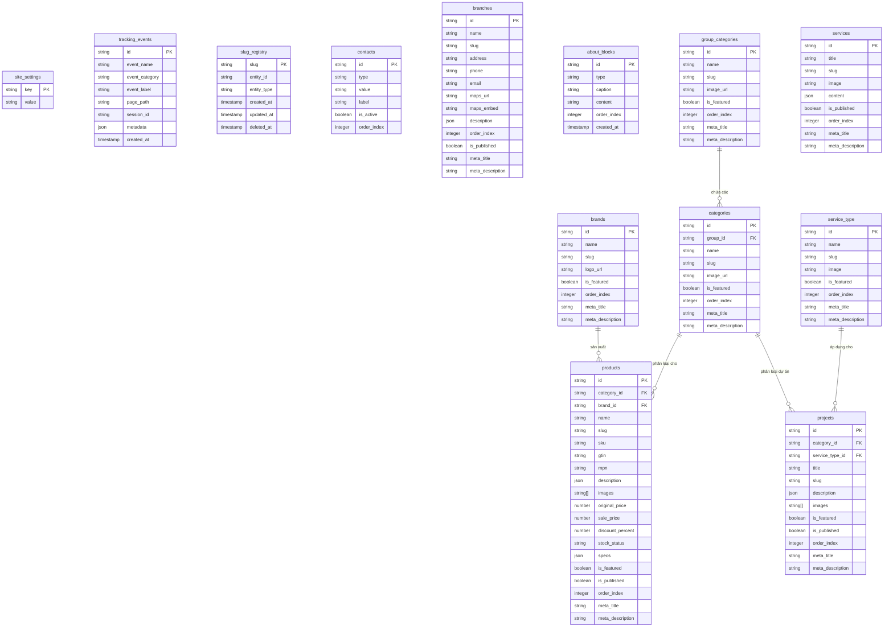

Báo cáo chi tiết hệ thống - Điện máy ELC

Tài liệu tổng hợp chi tiết toàn bộ các tính năng, các tác vụ nhỏ đã hoàn thành thực tế trong dự án điện máy ELC và các hệ thống logic chuyên sâu phục vụ cho sếp duyệt.

---

Phần 1: Chi tiết các tính năng và các tác vụ nhỏ đã thực hiện

I. Phân hệ quản trị (Admin dashboard)

Mọi màn hình quản trị dưới đây đều tích hợp bảng dữ liệu (DataTable có phân trang, tìm kiếm, sắp xếp), Form nhập liệu xác thực bằng Zod, hộp thoại xóa dữ liệu và kiểm tra ràng buộc khóa ngoại để bảo vệ tính toàn vẹn của dữ liệu.

**1. Quản trị sản phẩm (Products admin)**

- Xem danh sách: Bảng dữ liệu hiển thị SKU, hình ảnh, tên sản phẩm, thương hiệu, danh mục, giá gốc, giá bán và trạng thái (Nổi bật, Xuất bản). Tích hợp bộ tìm kiếm theo tên/SKU và phân trang.
- Thao tác chi tiết (Form quản trị được phân chia thành 4 Tab chuyên sâu cực kỳ chuyên nghiệp):
  - **Tab Thông tin chung (ProductGeneralTab)**: Xác thực nghiêm ngặt tên sản phẩm, mã SKU duy nhất, giá gốc, giá bán, tỉ lệ chiết khấu giảm giá tự động, thương hiệu liên kết, danh mục liên kết, trạng thái kho (còn hàng, hết hàng) và cấu hình bật/tắt nổi bật, xuất bản.
  - **Tab Thư viện ảnh (ProductGalleryTab)**: Quản lý bộ sưu tập ảnh của sản phẩm. Hỗ trợ tải lên cùng lúc nhiều ảnh lên Supabase Storage, kéo thả sắp xếp thứ tự hiển thị, xóa ảnh và tự động dọn rác tệp ảnh cũ trên Storage để giải phóng dung lượng cho công ty.
  - **Tab Thông số kỹ thuật (ProductSpecsTab)**: Lập trình cơ chế tạo thông số kỹ thuật động (specs) dưới dạng các cặp Key - Value (như công suất, loại gas, công nghệ tiết kiệm điện, xuất xứ...) phục vụ trực tiếp cho bộ lọc ngoài trang chủ.
  - **Tab Mô tả chi tiết (ProductDescriptionTab)**: Tích hợp trình soạn thảo văn bản phong phú (Rich Text Editor lưu dạng JSON) để soạn thảo bài giới thiệu chi tiết sản phẩm, hỗ trợ định dạng heading, in đậm, danh sách và nhúng hình ảnh trực quan.
- Xóa sản phẩm:
  - Thực hiện xóa sản phẩm khỏi hệ thống (Soft-delete để đảm bảo lịch sử dữ liệu).
  - Tự động dọn sạch toàn bộ kho hình ảnh liên quan của sản phẩm đó trên Cloud Storage.

**2. Quản trị danh mục sản phẩm chi tiết (Categories new admin)**

- Xem danh sách: Quản lý các dòng/danh mục sản phẩm con chi tiết (như máy lạnh treo tường, máy lạnh âm trần, máy lạnh tủ đứng...).
- Đặc điểm liên kết hệ thống đa chiều:
  - **Liên kết với Nhóm sản phẩm**: Mỗi danh mục con bắt buộc phải liên kết trực tiếp dưới một Nhóm sản phẩm lớn (như máy lạnh dân dụng, máy lạnh thương mại).
  - **Liên kết chéo với Loại hình dịch vụ**: Hệ thống hỗ trợ bảng liên kết chéo nhiều - nhiều để chỉ định danh mục sản phẩm này tương thích với loại hình dịch vụ kỹ thuật nào (ví dụ: Danh mục máy lạnh âm trần sẽ liên kết với dịch vụ tư vấn thiết kế và thi công hệ thống trung tâm VRV/VRF).
  - **Liên kết với Dự án**: Kết nối các danh mục sản phẩm con với các dự án thực tế đã hoàn thành để minh họa trực quan năng lực thi công dòng sản phẩm đó cho khách hàng.
- Thao tác quản trị:
  - Thêm mới danh mục: Nhập tên danh mục, tự động tạo slug URL không dấu phục vụ định tuyến, tải lên ảnh đại diện riêng lên Cloud Storage.
  - Cấu hình thẻ SEO Meta riêng biệt (meta_title, meta_description) để trang danh mục con tự động lên top Google độc lập.
  - Chỉnh sửa & Xóa danh mục con (chỉ cho phép xóa khi không còn sản phẩm hay dự án nào đang sử dụng danh mục đó để bảo vệ an toàn hệ thống).

**3. Quản trị nhóm danh mục lớn (Group categories admin)**

- Xem danh sách: Hiển thị các nhóm lớn kèm theo thứ tự hiển thị ưu tiên và ảnh đại diện nhóm.
- Thêm/Sửa/Xóa nhóm:
  - Cấu hình tên nhóm, ảnh đại diện lớn cho nhóm.
  - Tự động sinh slug URL chuẩn chỉ và đăng ký vào hệ thống tránh trùng lặp định tuyến URL.
  - Kiểm tra ràng buộc trước khi xóa: Không cho phép xóa nhóm lớn nếu đang có danh mục con hoặc sản phẩm bên dưới để tránh lỗi mất liên kết hệ thống.

**4. Quản trị danh mục sản phẩm cũ (Categories legacy admin)**

- Ghi chú hệ thống: Đây là phân hệ danh mục cũ đã được tối ưu hóa và chuyển giao sang phân hệ mới (Categories new admin) chạy trên bảng database `categories` nhằm tối ưu hóa liên kết đa chiều.

**5. Quản trị thương hiệu (Brands admin)**

- Thêm/Sửa/Xóa thương hiệu:
  - Nhập tên hãng, tải ảnh logo đại diện của hãng lên Cloud Storage.
  - Cấu hình mức độ ưu tiên hiển thị (is_featured, order_index) và các thông tin thẻ SEO phục vụ chiến dịch bán hàng của thương hiệu.
  - Ngăn chặn xóa thương hiệu nếu đang có sản phẩm thuộc thương hiệu đó đang kinh doanh.

**6. Quản trị dự án công trình (Projects admin)**

- Xem danh sách: DataTable hiển thị tên dự án, chủ đầu tư, địa điểm thi công, và trạng thái nổi bật.
- Thêm mới dự án:
  - Nhập tên dự án, chủ đầu tư, địa điểm, thứ tự ưu tiên hiển thị.
  - Thiết lập liên kết khóa ngoại đa chiều với Danh mục sản phẩm chi tiết (Category ID) và loại hình dịch vụ (Service Type ID).
  - Tải ảnh thực tế công trình thi công dạng mảng ảnh (images[]) lên đám mây.
  - Soạn thảo mô tả chi tiết dự án bằng trình soạn thảo văn bản phong phú (Rich Text Editor lưu dạng JSON) để viết bài giới thiệu quá trình thi công chi tiết.
  - Thiết lập SEO Metadata (Title, Description) riêng cho từng dự án.
- Chỉnh sửa & Xóa dự án: Cho phép sửa đổi toàn bộ bài giới thiệu dự án, mảng ảnh, hoặc xóa bài dự án đồng thời dọn sạch ảnh trên Storage.

**7. Quản trị khối giới thiệu doanh nghiệp (About blocks admin)**

- Xem danh sách: Quản lý các khối nội dung tĩnh dùng để giới thiệu năng lực doanh nghiệp, sứ mệnh và thành tựu ngoài trang chủ hoặc trang thông tin.
- Thêm/Sửa/Xóa khối: Cấu hình kiểu hiển thị (loại văn bản, hình ảnh, video), nhập nội dung mô tả chi tiết, tiêu đề phụ (caption) và thiết lập thứ tự hiển thị (order_index) thủ công.

**8. Quản trị bài viết dịch vụ (Services admin)**

- Xem danh sách: Hiển thị các bài giới thiệu dịch vụ (Lắp đặt, sửa chữa, bảo dưỡng...).
- Thêm mới dịch vụ:
  - Viết nội dung giới thiệu chi tiết dịch vụ dưới dạng JSON rich text (Rich Text Editor).
  - Tải lên hình ảnh đại diện lớn cho dịch vụ.
  - Thiết lập các cấu hình thẻ SEO cho trang dịch vụ.
- Chỉnh sửa & Xóa bài viết dịch vụ: Cập nhật nội dung hoặc xóa bài và dọn dẹp kho ảnh.

**9. Quản trị loại hình dịch vụ (Service types admin)**

- Xem danh sách: Bảng dữ liệu hiển thị các loại hình dịch vụ của công ty (Ví dụ: Thiết kế hệ thống, Thi công lắp đặt).
- Thêm/Sửa/Xóa loại hình dịch vụ: Tải ảnh đại diện cho loại hình dịch vụ, thiết lập trạng thái nổi bật và thứ tự ưu tiên hiển thị.

**10. Quản trị bài viết tin tức (News và blog admin)**

- Xem danh sách: Hiển thị danh sách bài viết tin tức, cẩm nang điện máy kèm ngày đăng, trạng thái nổi bật.
- Thêm mới bài viết:
  - Viết cẩm nang hướng dẫn sử dụng, mẹo bảo trì máy lạnh bằng trình soạn thảo nội dung phong phú JSON.
  - Tải ảnh đại diện bài viết.
  - Tùy chỉnh chi tiết các thẻ tiêu đề SEO và mô tả bài đăng riêng biệt cho từng bài viết để tối ưu hóa lên top Google Search.
- Chỉnh sửa & Xóa bài viết: Cho phép cập nhật nội dung hoặc xóa bài viết đồng thời dọn dẹp bộ nhớ ảnh.

**11. Quản trị trang tĩnh bổ sung (Pages admin)**

- Thêm/Sửa/Xóa các trang chính sách: Chính sách bảo hành, chính sách mua hàng, giới thiệu doanh nghiệp...
- Tính năng: Biên tập nội dung bài viết dạng JSON phong phú (Rich Text) và tự động đồng bộ hóa liên kết điều hướng xuống chân trang (Footer) của website.

**12. Quản trị kênh liên hệ (Contacts admin)**

- Thêm/Sửa/Xóa các kênh hỗ trợ: Số điện thoại Hotline, nick Zalo, Messenger hỗ trợ khách hàng của từng nhân viên kinh doanh cụ thể.
- Tính năng: Thiết lập trạng thái hoạt động và thứ tự hiển thị của từng hotline ngoài trang chủ.

**13. Quản trị hệ thống chi nhánh (Branches admin)**

- Xem danh sách: Bảng dữ liệu quản lý các chi nhánh/kho hàng/cửa hàng của ELC trên toàn quốc.
- Thêm mới chi nhánh:
  - Nhập thông tin liên hệ chi tiết: Địa chỉ văn phòng, số điện thoại hotline, email trực tiếp, thứ tự sắp xếp hiển thị.
  - Cấu hình bản đồ: Điền liên kết bản đồ Google Maps và mã nhúng iframe để hiển thị bản đồ động dẫn đường ngoài web.
  - Soạn thảo bài giới thiệu chi nhánh: Hỗ trợ tích hợp **trình soạn thảo nội dung phong phú (Rich Text Editor lưu dạng JSON)** để admin viết bài giới thiệu chi tiết về quy mô, đội ngũ kỹ thuật, máy móc thiết bị và hình ảnh thực tế của riêng chi nhánh đó.
  - Cấu hình thẻ SEO Meta riêng cho từng chi nhánh.
- Chỉnh sửa & Xóa chi nhánh: Cho phép cập nhật toàn bộ bài viết giới thiệu chi nhánh hoặc xóa chi nhánh kèm theo kiểm tra an toàn dữ liệu hệ thống.

**14. Cấu hình hệ thống chung (Settings admin)**

- Quản lý cấu hình cặp Key - Value: Cho phép admin chỉnh sửa trực tiếp tên công ty, địa chỉ văn phòng, email, hotline tổng, đường dẫn các mạng xã hội.
- Tuy chỉnh vùng giao diện trang chủ: Cho phép tùy biến tiêu đề chính (Hero Title), mô tả phụ, nội dung nút CTA và link dẫn nút CTA ở đầu trang chủ; đồng thời tùy biến nội dung tiêu đề, mô tả và nút kêu gọi hành động cuối trang chủ (CTA Section).

---

II. Phân hệ khách hàng (User website)

1. Giao diện trang chủ (Landing Page):
- Thiết kế Hero Banner động hiển thị tiêu đề và nút CTA theo cấu hình từ Admin.
- Trình bày danh sách thương hiệu đối tác lớn, dự án thực tế tiêu biểu, dịch vụ và sản phẩm mới nổi bật lấy trực tiếp từ database.

2. Tìm kiếm sản phẩm thông minh (Product Search Input):
- Thiết lập thanh tìm kiếm hỗ trợ tự động tìm kiếm không dấu, có tô màu làm nổi bật từ khóa khớp với từ khóa người dùng nhập vào.

3. Bộ lọc sản phẩm đa tiêu chí (Product Filters):
- Tích hợp bộ lọc phức tạp: Lọc theo danh mục sản phẩm, thương hiệu, khoảng giá và các thuộc tính kỹ thuật cụ thể (máy lạnh 1.5 HP, Inverter tiết kiệm điện...).
- Đồng bộ hóa bộ lọc lên URL (searchParams): Cho phép khách hàng chọn lọc sản phẩm và copy nguyên đường dẫn đó gửi cho người khác, khi mở ra vẫn giữ nguyên kết quả đã lọc.

4. Trang chi tiết sản phẩm:
- Hiển thị đầy đủ album hình ảnh dạng slide, thông số kỹ thuật chi tiết dạng bảng, mô tả sản phẩm (Rich text bài viết giới thiệu đầy đủ) và các sản phẩm liên quan.

5. Danh mục và bộ lọc dự án thực tế (Project showcase và filter):
- Danh sách dự án: Hiển thị các công trình thực tế đã thi công kèm theo hình ảnh công trình và thông tin mô tả cơ bản.
- **Thanh lọc dự án nâng cao (ProjectFilterBar)**: Cho phép khách hàng lọc nhanh danh sách dự án theo Danh mục sản phẩm (Category) hoặc theo loại hình Dịch vụ kỹ thuật tương ứng giúp tăng độ thuyết phục với khách hàng mới.
- Trang chi tiết dự án: Hiển thị đầy đủ bài viết giới thiệu chi tiết quá trình thi công (Rich text) và bộ sưu tập ảnh công trình thực tế chất lượng cao.

6. Hệ thống giới thiệu chi tiết và bản đồ chi nhánh (Branches):
- Hiển thị danh sách văn phòng, kho hàng kèm theo khung bản đồ Google Maps tương ứng.
- **Trang giới thiệu chi tiết chi nhánh**: Cho phép người dùng click vào từng chi nhánh để đọc bài giới thiệu chi tiết về chi nhánh đó (hình ảnh cơ sở vật chất, đội ngũ nhân viên thực tế và bản đồ động).

7. Giao diện xem danh sách và chi tiết dịch vụ, tin tức:
- Xem danh sách và bài viết giới thiệu chi tiết từng dịch vụ kỹ thuật, tin tức cẩm nang máy lạnh với đường dẫn URL thân thiện, tốc độ tải trang tối ưu.

8. Nút hành động liên hệ nhanh (Sticky Contacts):
- Thiết kế thanh liên hệ nổi bật (gọi điện thoại trực tiếp, nhắn tin Zalo...) thích ứng mượt mượt trên giao diện điện thoại.

9. Trang báo lỗi 410 chuyên nghiệp (Gone Page):
- Thiết kế một trang thông báo lỗi 410 chuyên dụng. Khi một sản phẩm hoặc bài viết ngưng kinh doanh/bị xóa vĩnh viễn, trang này sẽ hiển thị để báo cho Google Bot gỡ index trang đó lập tức, giúp tăng thứ hạng điểm SEO toàn trang.

---

Phần 2: Các tính năng kiến trúc chuyên sâu ẩn dưới hệ thống

Đây là phần giá trị kỹ thuật cao nhất của hệ thống, được lập trình kỹ lưỡng trong cơ sở dữ liệu:

1. Hệ thống tránh trùng lặp đường dẫn (Slug registry system):
- Để tránh việc trùng lặp tên đường dẫn (Slug URL) giữa các bài viết, sản phẩm, hoặc dự án khác nhau (gây sập hoặc định tuyến sai website), lập trình viên đã xây dựng bảng quản lý trung tâm slug_registry.
- Thiết lập các trigger tự động trên Postgres: Mỗi khi admin thêm mới sản phẩm/dự án/tin tức, database sẽ tự động kiểm tra xem đường dẫn này đã tồn tại trong hệ thống chưa, nếu trùng sẽ tự động sửa hoặc ngăn chặn để giữ an toàn tuyệt đối cho hệ thống định tuyến URL của web.

2. Hệ thống theo dõi và phân tích hành vi người dùng (Tracking events analytics):
- Hệ thống có tích hợp sẵn bảng tracking_events.
- Tự động ghi lại các sự kiện như: Người dùng xem trang nào (page_path), bấm vào liên hệ của ai, thực hiện tìm kiếm từ khóa gì... kết hợp với ID phiên làm việc (session_id) để doanh nghiệp tự phân tích hành vi khách hàng mà không phụ thuộc hoàn toàn vào các tập lệnh nặng nề bên thứ ba.

3. Công cụ tìm kiếm thông minh trong cơ sở dữ liệu (Database functions):
- Lập trình viên đã viết các hàm xử lý chuỗi trên database Postgres:
  - Hàm unaccent: Tự động loại bỏ dấu tiếng Việt (ví dụ chuyển "Máy lạnh Daikin" thành "May lanh Daikin") để phục vụ tìm kiếm không dấu.
  - Hàm slugify: Tự động tạo chuỗi URL không dấu, thay dấu cách bằng gạch ngang từ tên tiêu đề sản phẩm do admin nhập vào.
  - Tích hợp công cụ tìm kiếm mờ (Fuzzy search) sử dụng Trigram Index (pg_trgm) giúp tìm kiếm sản phẩm chính xác ngay cả khi người dùng gõ sai chính tả một vài ký tự.

4. Bảo mật cơ sở dữ liệu nâng cao (RLS và Triggers):
- Thiết lập các chính sách bảo mật hàng (Row Level Security - RLS) trên toàn bộ các bảng trong database. Đảm bảo người dùng thường chỉ được quyền xem (Read), còn các thao tác chỉnh sửa, xóa (Write, Delete) bắt buộc phải qua xác thực quyền Admin từ Supabase.

---

Phần 3: Sơ đồ liên kết thực tế trong database (Mermaid)

